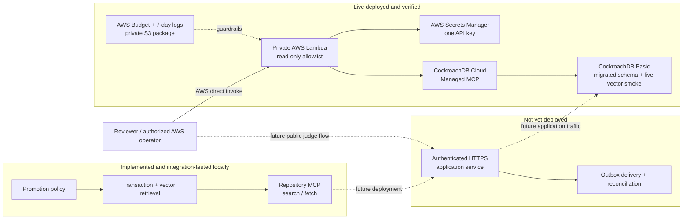

# Architecture and trust boundaries

This document is authoritative for component responsibility and trust
boundaries. Current implementation state belongs in
[PROJECT_STATUS.md](PROJECT_STATUS.md); implementation order belongs in
[ROADMAP.md](ROADMAP.md).

## Authority model

Continuum distinguishes observations from durable authority:

```text
untrusted source
    |
    v
candidate_memories
    |
    | deterministic policy evaluation
    v
promotion transaction
    +--> canonical_memories
    +--> candidate decision metadata
    |
    v
idempotent action claim
```

- **Candidate memory** is untrusted input. Its existence does not authorize
  retrieval or an external action.
- **Policy decision** is deterministic application logic. It explains whether a
  candidate is eligible for promotion.
- **CockroachDB transaction** is the durable authority boundary. It decides
  which concurrent attempt commits.
- **Canonical memory** is accepted state scoped to a tenant and incident.
- **Action claim** selects one database winner for an idempotency key. It is not
  proof that an external provider performed the effect.

## Implemented P2A boundary

The repository implements:

```text
Python policy kernel
    -> CockroachMemoryStore
    -> PostgreSQL wire protocol
    -> CockroachDB transaction
       - candidate row lock
       - policy decision
       - canonical insertion or rejection audit
       - serialization retry
    -> action_attempts unique-key claim
    -> accepted payload embedding
    -> tenant + incident prefix vector query
    -> retrieval_audit
    -> read-only MCP search/fetch
```

The test environment launches an ephemeral CockroachDB node, applies the
packaged versioned migrations, and exercises migration replay, drift detection,
DDL/history crash recovery, lease exclusion, promotion, rejection, concurrent
claims, vector persistence, retrieval audit, cross-tenant exclusion, and a
synthetic end-to-end database smoke path. The MCP protocol is tested with an
in-memory client/server transport. The same migration and synthetic vector path
was subsequently live-smoked on the participant CockroachDB Cloud cluster; the
repository MCP service itself is not publicly deployed.

## Live evidence boundary

The first cloud component is deployed and live-smoked:

```text
authorized AWS direct invoke
    -> private Lambda evidence worker
       - read-only Managed MCP tool allowlist
       - input/output bounds
       - one Secrets Manager ARN
       - optional reserved concurrency 1 when the account quota can retain
         AWS's minimum unreserved concurrency; otherwise no reservation
       -> CockroachDB Cloud Managed MCP over HTTPS
```

The Lambda intentionally has no Function URL, API Gateway, VPC, or NAT Gateway.
It is an operational evidence client, not the repository MCP service and not a
public application authorization boundary.

The live-versus-planned boundary is:



The private AWS worker, its minimum-IAM role, its one-secret boundary, the
Managed MCP connection, two read calls, application schema, and synthetic
vector query execution are live. The authenticated repository MCP service and
outbox remain planned as shown. The live SQL smoke used a temporary workstation
network rule that was removed immediately afterward; the current allowlist is
empty.

## Component ownership

| Component | Owns | Must not own |
|---|---|---|
| Policy kernel | eligibility rules and deterministic decision reason | transaction outcome or external side effects |
| Store transaction | row locking, persistence, replay, conflict retry | changing policy meaning |
| Migration runner | ordered single-statement DDL, durable intent, checksums, renewable lease, schema validation, explicit adoption | hiding drift, guessing a partial legacy schema, or claiming DDL/history atomicity |
| CockroachDB | durable accepted state, uniqueness, audit, concurrent winner | interpreting untrusted prose |
| Repository MCP boundary | authenticated, least-privilege `search`/`fetch` contract | database credentials or caller-selected tenant scope |
| CockroachDB Managed MCP | managed operational database tools for the competition agent | replacing application retrieval authorization |
| Private AWS evidence worker | bounded direct invocation of a hard-coded read-only Managed MCP subset | public query access, row-level tenant authorization, or arbitrary Managed MCP writes |
| Retrieval service | tenant filter, embedding query, retrieval audit | promotion of untrusted candidates |
| Outbox worker | delivery attempts, leases, acknowledgement, reconciliation | rewriting canonical memory |
| Reviewer console | understandable evidence and scenario control | secret material or unverified production claims |

## Required trust controls

1. Tenant and incident scope must be checked in both application queries and
   database constraints/authorization.
2. Candidate payloads must be treated as data, never as executable instruction.
3. Promotion and audit persistence must commit atomically.
4. Source identity and action idempotency must be unique at the durable layer.
5. Serialization failures must retry the entire transaction.
6. External calls must happen outside the promotion transaction through an
   outbox-style delivery boundary.
7. Secrets must remain server-side and be injected through an approved secret
   channel.
8. A bearer-token destination must be pinned to the official HTTPS host; a
   configurable endpoint must not become a credential-exfiltration path.
9. Managed MCP write tools must be denied before the worker reads its secret.
10. Applied migration bytes are immutable; checksum drift and uncertain schema
    states must fail closed.

## Failure semantics

- A policy rejection is a durable, auditable outcome.
- A serialization conflict is retriable and must not leak a partial result.
- A repeated source event returns the prior canonical result.
- A repeated action key returns a duplicate claim, not a second database winner.
- A network timeout after an external send is ambiguous until acknowledged or
  reconciled; it must not be described as exactly-once delivery.

Detailed transaction mechanics are in
[TRANSACTION_MODEL.md](TRANSACTION_MODEL.md).
