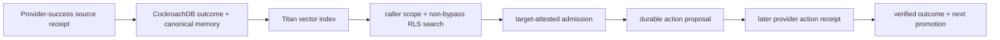

# Online CockroachDB memory-lineage closure

## Technical summary

This milestone removes the last split between the real-provider transfer
evaluation and the deployed sponsor-database path. A successful disposable
GitHub Actions outcome is projected through an explicit fact allowlist,
promoted into canonical CockroachDB memory, embedded with Amazon Titan, and
retrieved through the fixed demo caller's non-bypass SQL role. A separately
attested target then either receives that memory as action authority or must
use a current read-only diagnostic. The proposed action is durably stored
before the provider is called; only the later verified provider receipt may
create the next canonical memory.

The repository implementation and deterministic regression suite are PASS.
Until the reviewed `main` workflow produces an exact-head report with every
gate true, the live architectural claim remains HOLD.

Live predecessor `31501325773` is intentionally retained as FAIL: exact-head
deployment stopped before any provider, database, or model call because the
workflow omitted the deployment script's CA-path environment contract. The
always-run cleanup confirmed that no temporary EC2 IAM policy remained. The
repair adds the missing contract and creates a non-secret preflight receipt
before deployment so even an early failure has an artifact; it does not weaken
any evaluation predicate.

## What the implementation now proves

| Result | Required evidence | Status before the live run |
| --- | --- | --- |
| Provider payload cannot become arbitrary prompt authority | Canonical-memory projection accepts only bounded outcome facts and rejects unknown fields | Source/test PASS |
| The model calls the deployed scoped store | `search_memory` and `fetch_memory` invoke server-owned tools, retaining retrieval IDs and detecting search/fetch drift | Source/test PASS |
| Historical demo rows cannot satisfy the proof accidentally | Admission is pinned to the newly promoted source memory ID after actual vector retrieval | Source/test PASS |
| Same-cause and near-neighbour decisions use separate target evidence | Read-only target attestation is joined server-side by causal signature; incompatible memory is visible but cannot authorize an action | Source/test PASS |
| External effect follows durable intent | Two remediation workflows may be dispatched only after two CockroachDB proposal rows exist | Workflow contract PASS; live HOLD |
| Successful effects teach the next episode | Finalization joins run, proposal, outcome, canonical memory, retrieval audit, citation, provider receipt, embedding model, and RLS checksum | Workflow contract PASS; live HOLD |
| Cross-scope data remains inaccessible | A freshly embedded sentinel in another incident must be invisible to the resolved runtime role, including negative write checks | Workflow contract PASS; live HOLD |

## Scope and metric definitions

- **Architectural pair:** one preregistered source failure family evaluated
  against one same-cause target and one confusable near-neighbour target.
- **Same-cause success:** the exact newly promoted source memory is selected,
  no current diagnostic is used, the exact expected patch is proposed, and its
  later provider receipt succeeds.
- **Near-neighbour rejection:** the source memory may be retrieved but is not
  selected as authority; exactly one registered current diagnostic is used and
  the exact target patch succeeds.
- **Canonical promotion precision for this proof:** every promoted source or
  target memory has a verified successful external-provider receipt; failed or
  incompatible evidence creates no promotion.
- **Cross-scope leakage:** any visibility of the fresh forbidden memory, any
  visible row/audit outside the caller's tenant and incident, or any successful
  negative write makes the gate fail.
- **Temporal closure:** every target action receipt must have a provider
  creation time at or after the durable-proposal timestamp.

The live sample contains one source family and two target cases. It is intended
to establish end-to-end architectural closure, not a population-level effect
size. The sealed multi-pair transfer benchmark remains the statistical evidence
for comparative behavior.

## Method and fail-closed order

1. A main-only OIDC workflow builds and deploys the exact reviewed head.
2. It generates and checksum-seals a fresh transfer challenge before any
   provider call.
3. Disposable GitHub Actions runs produce negative source calibrations, one
   successful source receipt, two read-only target attestations, and bounded
   near-neighbour diagnostic receipts.
4. Fixed-egress EC2 receives temporary access only to the runtime and migrator
   secrets plus the exact evidence S3 prefix. It promotes and Titan-indexes the
   source outcome, resolves the server-owned caller scope, proves RLS isolation,
   runs Bedrock with actual scoped search/fetch tools, and writes two proposals.
5. The workflow validates those durable proposal artifacts before dispatching
   either target remediation.
6. EC2 reconciles the later provider receipts, promotes successful outcomes,
   indexes them, and executes the database lineage joins.
7. Temporary EC2 authority is revoked on every path. The exact-head artifact is
   uploaded even on failure, while only a report with all predicates true is
   eligible for public release.

## Robustness and limitations

- Candidate-visible model input contains no expected label or scoring policy;
  those fields remain in the independent workflow evaluator. The orchestration
  process necessarily retains them to score the final receipt.
- The near-neighbour diagnostics are pre-executed read-only provider receipts
  so the fixed-egress model host needs no GitHub credential. Only the one receipt
  actually requested by the model enters the episode lineage.
- Reusing the reviewed demo scope avoids minting new SQL authority. A newly
  generated source memory ID allowlist prevents prior rows in that scope from
  satisfying this proof.
- GitHub Actions is a disposable real external provider, not a customer
  production remediation system. The claim is bounded to its registered
  capability and receipt contract.
- A live failure must preserve the existing immutable v20 release. It must not
  be converted to PASS by weakening label, retrieval, isolation, timing, or
  provider-success predicates.

## Release gate

Public promotion requires one reviewed `main` run whose report proves all of
the following together:

- exact source SHA and deployment artifact digest;
- unique, mutation-free provider receipts and zero cleanup residuals;
- Titan-indexed source and target canonical memories;
- same-cause selection with zero diagnostic and near-neighbour rejection with
  exactly one current diagnostic;
- exact patches, two successful provider outcomes, and two promotions;
- durable-proposal-before-provider-action ordering;
- joined database episode and retrieval-audit lineage;
- expected non-bypass scope role, zero cross-scope visibility, and the reviewed
  RLS migration checksum; and
- final status `PASS` without manual reinterpretation.

## After closure

The next decision should be based on what the live receipt reveals. If it
passes, the highest-value follow-up is a judge-facing evidence compiler that
turns the joined memory/retrieval/proposal/outcome IDs into a short interactive
episode narrative. If it fails, repair the first broken real boundary with a
small reviewed PR and rerun the unchanged gate; do not add features around an
unclosed lineage.
