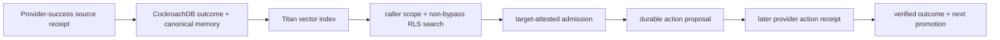

# Online CockroachDB memory-lineage closure

## Technical summary

This milestone removes the last split between the real-provider transfer
evaluation and the deployed sponsor-database path. A successful disposable
GitHub Actions outcome is projected through an explicit fact allowlist,
promoted into canonical CockroachDB memory, embedded with Amazon Titan, and
retrieved through the fixed demo caller's non-bypass SQL role. A separately
attested target then either receives that memory as action authority or must
use a current read-only diagnostic. The proposed action is durably stored
before the provider is called; only the later verified provider receipt may
create the next canonical memory.

The repository implementation, deterministic regression suite, and live
reconciliation are PASS. Recovery run `31506117708` on reconciler head
`9bfb9017e03b33b56fa0af942ed111b4362336d9` consumed the exact failed-candidate
artifact from run `31503686643` and completed the CockroachDB outcome and
canonical-memory joins without dispatching another provider action.

Live predecessor `31501325773` is intentionally retained as FAIL: exact-head
deployment stopped before any provider, database, or model call because the
workflow omitted the deployment script's CA-path environment contract. The
always-run cleanup confirmed that no temporary EC2 IAM policy remained. The
repair adds the missing contract and creates a non-secret preflight receipt
before deployment so even an early failure has an artifact; it does not weaken
any evaluation predicate.

Live predecessor `31501943324` is also retained as FAIL. It successfully
deployed exact head `1393435918e7f7b8e3eb0ff065a76b2ff2cac4fd`, sealed the
challenge, obtained all seven preparation receipts, and granted the bounded
one-command role policy. The first EC2 command then stopped because the private
host package omitted `run_online_memory_lineage.py`; no target proposal or
target action was produced. Cleanup removed the temporary IAM policy and the
sealed preflight/provider artifacts were retained. The repair changes only the
private package allowlist and removes an uninstalled `scripts.*` dependency.

Live predecessor `31503686643` progressed through the complete candidate path:
source promotion, real Titan/RLS retrieval, two durable proposals, and two
later successful target provider actions. Final reconciliation then failed
before either target approval or promotion because it read `fixture_id` from
the inner attestation payload instead of the registered patch-family mapping.
The temporary IAM policy was removed and the exact proposals/outcomes artifact
was retained. The recovery path deliberately does not dispatch new provider
actions: a main-only OIDC workflow with `actions: read` validates that artifact,
deploys the repaired reconciler, and resumes the existing database proposals.
Its public receipt binds both the candidate head and reconciler head and must
report provider action reexecution count zero.

Recovery predecessor `31505581790` is retained as FAIL. It validated the exact
candidate artifact under read-only Actions permission, then stopped before
deployment because values written to `GITHUB_ENV` are not visible until the
next workflow step. It never granted temporary instance authority or touched
the database. The repair exports only the already resolved deployment contract
inside that step while retaining the same values in `GITHUB_ENV` for later
steps.

Recovery run `31506117708` then passed every frozen predicate. The original
candidate head `9fed05095f2283d919915387d02198bf4faa677f` remains the head of
all six provider receipts, including action runs `31503922040` and
`31503923725`; the repaired reconciler is separately identified. The report's
self receipt is `dd249605d58884391cb5adca45f48f871593435381307624f73b5573b98e6929`,
the Actions archive digest is
`sha256:7d23ab01720c9fca14c1cfc4fabd9e3af16d6603ee7beafd63df316c5c158bf0`,
and the reviewed RLS checksum is
`69a168e1e55440bf563483947f5438855e93a715a56eb702f49a845d360b4e02`.

## What the implementation now proves

| Result | Required evidence | Live status |
| --- | --- | --- |
| Provider payload cannot become arbitrary prompt authority | Canonical-memory projection accepts only bounded outcome facts and rejects unknown fields | Source/test PASS |
| The model calls the deployed scoped store | `search_memory` and `fetch_memory` invoke server-owned tools, retaining retrieval IDs and detecting search/fetch drift | Source/test PASS |
| Historical demo rows cannot satisfy the proof accidentally | Admission is pinned to the newly promoted source memory ID after actual vector retrieval | Source/test PASS |
| Same-cause and near-neighbour decisions use separate target evidence | Read-only target attestation is joined server-side by causal signature; incompatible memory is visible but cannot authorize an action | Source/test PASS |
| External effect follows durable intent | Two remediation workflows may be dispatched only after two CockroachDB proposal rows exist | Live PASS; both action creation times follow the durable proposal receipt |
| Successful effects teach the next episode | Finalization joins run, proposal, outcome, canonical memory, retrieval audit, citation, provider receipt, embedding model, and RLS checksum | Live PASS; both target outcomes were promoted |
| Cross-scope data remains inaccessible | A freshly embedded sentinel in another incident must be invisible to the resolved runtime role, including negative write checks | Live PASS; foreign rows zero and all four negative capability checks denied |

## Scope and metric definitions

- **Architectural pair:** one preregistered source failure family evaluated
  against one same-cause target and one confusable near-neighbour target.
- **Same-cause success:** the exact newly promoted source memory is selected,
  no current diagnostic is used, the exact expected patch is proposed, and its
  later provider receipt succeeds.
- **Near-neighbour rejection:** the source memory may be retrieved but is not
  selected as authority; exactly one registered current diagnostic is used and
  the exact target patch succeeds.
- **Canonical promotion precision for this proof:** every promoted source or
  target memory has a verified successful external-provider receipt; failed or
  incompatible evidence creates no promotion.
- **Cross-scope leakage:** any visibility of the fresh forbidden memory, any
  visible row/audit outside the caller's tenant and incident, or any successful
  negative write makes the gate fail.
- **Temporal closure:** every target action receipt must have a provider
  creation time at or after the durable-proposal timestamp.

The live sample contains one source family and two target cases. It is intended
to establish end-to-end architectural closure, not a population-level effect
size. The sealed multi-pair transfer benchmark remains the statistical evidence
for comparative behavior.

## Method and fail-closed order

1. A main-only OIDC workflow builds and deploys the exact reviewed head.
2. It generates and checksum-seals a fresh transfer challenge before any
   provider call.
3. Disposable GitHub Actions runs produce negative source calibrations, one
   successful source receipt, two read-only target attestations, and bounded
   near-neighbour diagnostic receipts.
4. Fixed-egress EC2 receives temporary access only to the runtime and migrator
   secrets plus the exact evidence S3 prefix. It promotes and Titan-indexes the
   source outcome, resolves the server-owned caller scope, proves RLS isolation,
   runs Bedrock with actual scoped search/fetch tools, and writes two proposals.
5. The workflow validates those durable proposal artifacts before dispatching
   either target remediation.
6. EC2 reconciles the later provider receipts, promotes successful outcomes,
   indexes them, and executes the database lineage joins.
7. Temporary EC2 authority is revoked on every path. The exact-head artifact is
   uploaded even on failure, while only a report with all predicates true is
   eligible for public release.

## Robustness and limitations

- Candidate-visible model input contains no expected label or scoring policy;
  those fields remain in the independent workflow evaluator. The orchestration
  process necessarily retains them to score the final receipt.
- The near-neighbour diagnostics are pre-executed read-only provider receipts
  so the fixed-egress model host needs no GitHub credential. Only the one receipt
  actually requested by the model enters the episode lineage.
- Reusing the reviewed demo scope avoids minting new SQL authority. A newly
  generated source memory ID allowlist prevents prior rows in that scope from
  satisfying this proof.
- GitHub Actions is a disposable real external provider, not a customer
  production remediation system. The claim is bounded to its registered
  capability and receipt contract.
- A live failure preserved the immutable v20 release. It could not
  be converted to PASS by weakening label, retrieval, isolation, timing, or
  provider-success predicates; only the later exact-receipt recovery was
  promoted and bound to immutable v21, Pages, and the credential-free monitor.

## Release gate

Public promotion requires one reviewed `main` run whose report proves all of
the following together:

- exact source SHA and deployment artifact digest;
- unique, mutation-free provider receipts and zero cleanup residuals;
- Titan-indexed source and target canonical memories;
- same-cause selection with zero diagnostic and near-neighbour rejection with
  exactly one current diagnostic;
- exact patches, two successful provider outcomes, and two promotions;
- durable-proposal-before-provider-action ordering;
- joined database episode and retrieval-audit lineage;
- expected non-bypass scope role, zero cross-scope visibility, and the reviewed
  RLS migration checksum; and
- final status `PASS` without manual reinterpretation.

## After closure

The judge-facing compiler now publishes the joined memory, retrieval, proposal,
provider action, outcome, promotion, candidate, reconciler, and RLS receipts as
a redacted deterministic projection. The full verifier independently reads the
failed candidate, successful reconciler, both Actions artifacts, both action
runs, public bytes, and immutable release asset.

The next fundamental P0 is **outcome-receipt compare-and-set plus a
database-native reconciliation journal**. The current SQL replay path returns a
previous outcome for the proposal without first proving that the replayed
provider, receipt ID, status, and receipt digest are identical. The workflow
artifact made this recovery safe, but that invariant belongs at the durable
database boundary. A retry with a different receipt must become a typed
conflict, while an exact replay must return the same outcome and promotion.
This removes the remaining cross-head trust gap instead of adding another
benchmark or security feature around it.
